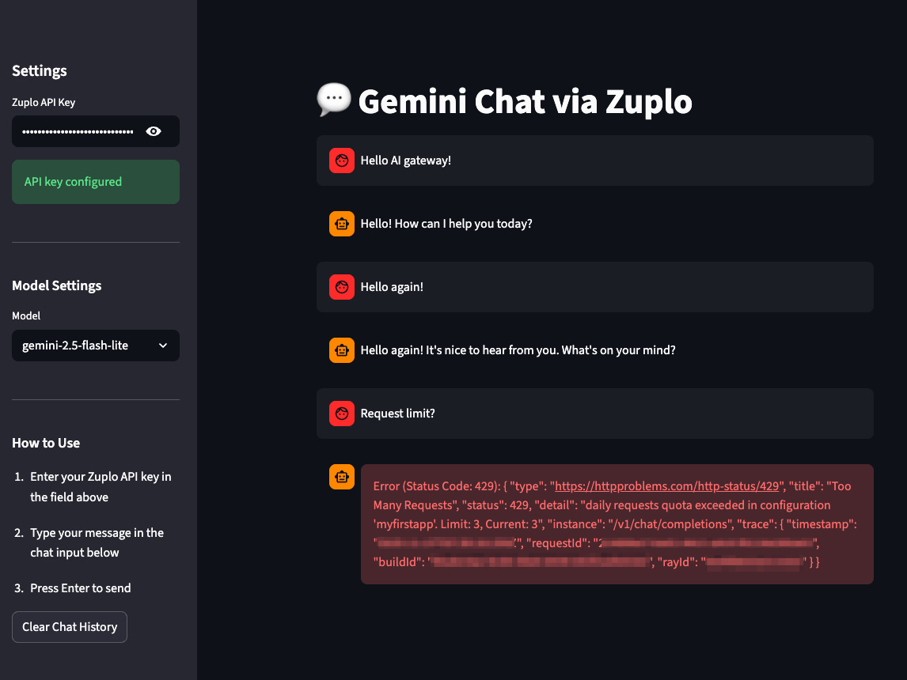

# Gemini Chat via Zuplo AI Gateway

A simple chat interface built with Streamlit that connects to Google's Gemini AI models through Zuplo AI Gateway.

## Features

- 💬 Clean and intuitive chat interface
- 🔄 Conversation history management
- 🎨 Multiple Gemini model support
- 🔐 Secure API key handling
- ⚡ Real-time responses


## Prerequisites

- Python 3.8 or higher
- Zuplo AI Gateway endpoint
- Valid API key for Zuplo/Gemini access

## Installation

1. Clone this repository:
```bash
git clone <your-repository-url>
cd <repository-name>
```

2. Install required dependencies:
```bash
pip install streamlit requests
```

Or use requirements.txt:
```bash
pip install -r requirements.txt
```

## Configuration

Before running the application, you need to configure your Zuplo AI Gateway endpoint:

1. Open `app.py`
2. Replace the `ZUPLO_ENDPOINT` value with your own endpoint:
```python
ZUPLO_ENDPOINT = "https://your-zuplo-endpoint.zuplo.app/v1/chat/completions"
```

## Usage

1. Run the Streamlit application:
```bash
streamlit run app.py
```

2. The application will open in your default web browser (typically at `http://localhost:8501`)

3. In the sidebar:
   - Enter your Zuplo API key
   - Select your preferred Gemini model
   - Start chatting!

4. Type your message in the chat input box and press Enter to send

## Available Models

- `gemini-2.5-flash-lite` - Faster, lightweight model
- `gemini-2.5-flash` - Balanced performance model

## Project Structure

```
.
├── app.py              # Main application file
├── requirements.txt    # Python dependencies
└── README.md          # This file
```

## requirements.txt

```
streamlit>=1.28.0
requests>=2.31.0
```

## Security Notes

- Never commit your API keys to version control
- Use environment variables or secure vaults for production deployments
- The API key is entered through the UI and stored only in the session state

## Troubleshooting

### Connection Timeout
If you encounter timeout errors, check:
- Your internet connection
- Zuplo endpoint availability
- API key validity

### API Key Issues
- Ensure your API key has proper permissions
- Verify the key is correctly entered without extra spaces
- Check if the key hasn't expired

## Acknowledgments

- API Gateway by [Zuplo](https://zuplo.com/)
- Built with [Streamlit](https://streamlit.io/)
- Powered by [Google Gemini](https://deepmind.google/technologies/gemini/)
